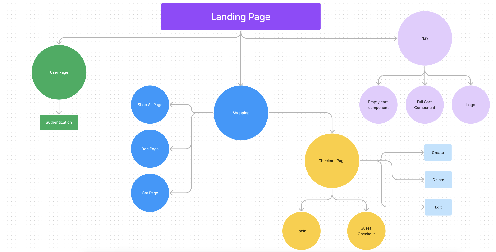
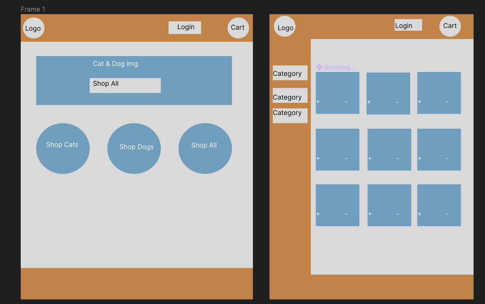
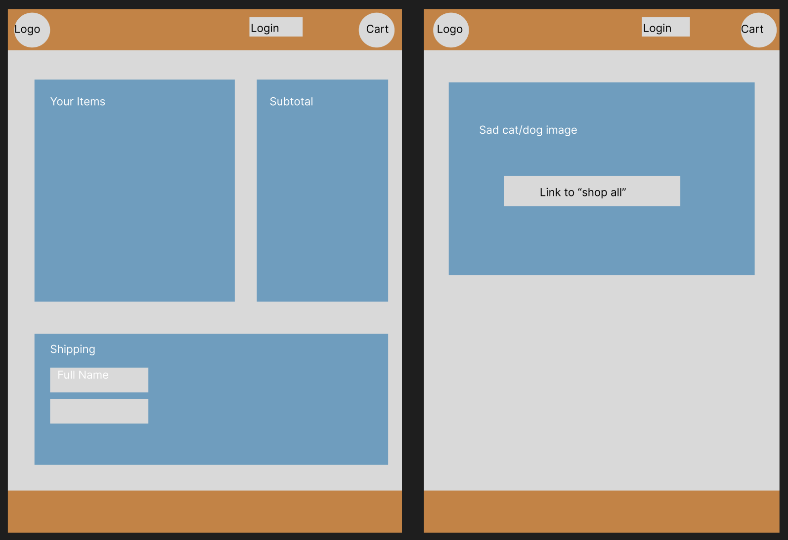
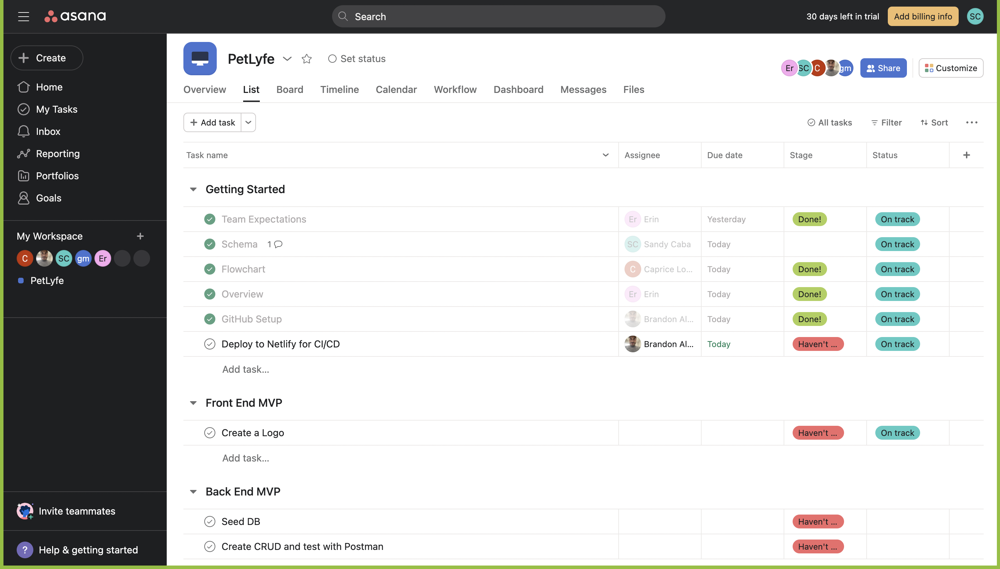

# Pet Style App

[Link to Back-End Repo](https://github.com/Brandon-Alvarez-03/pet-lyfe-backend)

## Placeholders

---

1. Overview
2. Link to API/Backend Repo
3. Meet the Team
4. Wireframing
5. Whimsical tools
6. Schemas
7. Link to PM Board
8. Explanation of App
9. Screenshots of App
10. CRUD breakdown
11. Tools, tech, and skills used
12. Add profile view counter

[Github Repo](https://github.com/Brandon-Alvarez-03/pet-style-mern)

**Railway:**

**Netlify:**

## Overview


### Brand Statement:

Did your pet chew up their toys again? Searching for new accessories to swag out your newly adopted fur baby?

Welcome to PetLyfe — your trusted online pet accessory shop committed to providing cats and dogs with a wide variety of high-quality toys and accessories.

We love our pets, and we know you do too. Above all, we love spoiling them with fun, snazzy accessories so they live life to the fullest. 

Our lives are defined by special moments with our fur babies. We believe that bedazzling their lives with fun and excitement creates unforgettable memories that last a lifetime. 

At PetLyfe, we don’t just bring joy to the ~~children~~ animals we adore. We bring joy to humans too.

### PetLyfe.com Outline:

- #### HOME PAGE:

When visiting PetLyfe.com, visitors will be greeted with a landing page featuring a welcome image featuring pets with our products and a call to action button: "Shop All".

Below, visitors will be directed to shop for cats or dogs to better filter the product content for the user. There will also be another "Shop All" option.

Below the cats and dogs filter section, visitors will be encouraged to create an account to sign up for exclusive discounts and offers.

- #### NAVIGATION BAR

On the top left of the header, our logo will take visitors to the home page.

On the top right, visitors can click on Shop All, Login, and View shopping cart (with an image of a shopping cart).

- #### FOOTER

On the bottom of the screen, a footer will provide links to Shop All, Login, Shopping cart, and About.

- #### SHOPPING PAGE:

On the shop all page, visitors will see all products in our inventory with the option to view details and add product to their shopping cart. Visitors can also filter by cat or dog.

- #### CHECKOUT PAGE:

Visitors will see what items are in their carts and proceed by logging in or checking out as a guest.

Visitors can add more items, edit their cart, or delete items.

They can pay with a mock credit card input section, and once accepted, the screen will read: “Your fur baby thanks you for your order!” with a "Return to products" button.

## Team Members

- Brandon Alvarez
- Sandy Caba
- Erin Baright
- Caprice Genninger
- Gary Bowen


## Data Schema

Products:

```JSON
const Product = new Schema
(
  {
    name: {
      type: String,
      required: true
      },
    imgURL: {
      type: String,
      required: true
      },
    price: {
      type: Number,
      required: true
      },
    rating: {
      type: Number,
      required: false
      }
  },
)
```


## Component Hierarchy

[Flow Chart](https://www.figma.com/file/YJa4nQJAdoLtJ89YgJ5VX4/Data-Flow?node-id=0%3A1)




---

## Wireframes & Branding (Caprice)

[Wireframe](https://www.figma.com/file/AqD4o1McErCQNpwiEtu1LG/Untitled?node-id=0%3A1)




---

## Team Expectations

[Team Expectations](https://docs.google.com/document/d/1-zIWTr3SB-H0CEnunKl643faMRZ34qR3WFkCExWqjlo/edit?usp=sharing)

## Content Management



---

## MVP GOALS

- Use MongoDB and Express to create the back-end
- Use React to create the front-end
  - Use multiple functional components
- Give user capability for full CRUD (products for MVP, see post-MVP... preferred CRUD demonstration)
- Deploy to Railway and Netlify
- CSS styling to match wireframe and branding
  - Responsive Design

## POST MVP GOALS

- Add user capability to review products (with full CRUD capability)
- Loading animation on home page
- Ability to edit a user profile

## Project Schedule

| Date      | Deliverable                                                |   Status   |
| :-------- | :--------------------------------------------------------- | :--------: |
| Nov 3     | Project Team Building                                      |  Complete  |
| Nov 4     | Wireframes + Final Project Approval                        |  Complete  |
| Nov 5 - 6 | Create Back-End (group code)                               | Incomplete |
| Nov 7     | Continue Back-End (group code) + Testing + Deploy Back-End | Incomplete |
| Nov 8     | Working on React Front-End                                 | Incomplete |
| Nov 9     | Working Prototype + CSS Styling                            | Incomplete |
| Nov 10    | Present and Celebrate                                      | Incomplete |
